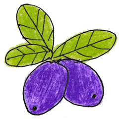

# Haskap Jam Pack


## Introduction
Haskap Jam Pack is an extension package for [Sonic Pi]( http://sonic-pi.net). This package adds the following three features to Sonic Pi.

* jam session
* robot voice
* log forwarding
* ruby-processing (experimental)

This project is originally started at [SIAF LAB](http://www.sapporo-internationalartfestival.jp/siaflab/sonic-jam-pi/) by @keikomachiya as a stand alone application named "Hascap Jam Pi" in 2015 and re-written as an extension package by @kn1kn1.

## Requirements
Sonic Pi v2.10

## Installation
Download zip file from [Release Page](https://github.com/siaflab/haskap-jam-pack/releases/) and extract it.

## jam session
### Configuration
#### Server
Set the server listening port and Sonic Pi listening port in haskap-jam-server-config.json.
```json
"receivePort": <server listening port>,
"socicPiPort": <Sonic Pi listening port>(default: 4557)
```

#### Client
Set the server IP address and listening port in haskap-jam-config.rb.
```rb
remote_address: '<server IP address>',
remote_port: <server listening port>,
```

### Usage
#### Server
* Open Sonic Pi.
* Start haskap-jam-server.

```
Usage of haskap-jam-server:
  -d	print debug output
  -debug
    	print debug output
  -v	show version
  -version
    	show version
```

You may find `-d` or `-debug` option useful when you use this command for the first time.

```sh
$ cd server/jam-server; ./bin/darwin_amd64/haskap-jam-server -d
config.ReceivePort: 4559
config.SocicPiPort: 4557
#####
2016-02-27 12:15:01.93834047 +0900 JST
haskap-jam-server started successfully.
version: 0.1.0-alpha1, build: 06f72ff, date:2016-02-25T16:10:43+0900
listening to udp 4559
and will send to udp 4557
#####
-----
2016-02-27 12:17:30.767371905 +0900 JST
Received from: 127.0.0.1:56826
size: 176
# Welcome to Sonic Pi v2.9

#load "~/github/haskap-jam-pack/client/haskap-jam-loop.rb"

jam_loop :test do
sample :perc_bell, rate: rrand(-1.5, 1.5)
sleep rrand(0.1, 2)
stop
end

(snip)
```

#### Client
* Open Sonic Pi.
* Include `load "[path to haskap-jam-loop.rb]/haskap-jam-loop.rb"` in the code and use `jam_loop` instead of `live_loop`.

```ruby
load "~/haskap-jam-pack/client/haskap-jam-loop.rb"

jam_loop :test do
  sync :foo
  play 60
  sleep 0.5
end
```
* Run the code!

## robot voice
### Usage
* Open Sonic Pi.
* Include `load "[path to haskap-jam-voice.rb]/haskap-jam-voice.rb"` in the code and use "voice" command.

```ruby
load "~/haskap-jam-pack/client/haskap-jam-voice.rb"

// c4 with "do"
voice "do", :c4
```

You can also play with "voice_pattern" or "voice_pattern_timed" command and specify chord or scale as a note argument.

```ruby
load "~/haskap-jam-pack/client/haskap-jam-voice.rb"

voice "ra", chord(:E3, :minor)

voice_pattern "ra", chord(:E3, :m7)

voice_pattern_timed "ra", chord(:E3, :m7), 0.25

voice_pattern_timed "ra", scale(:E3, :minor), 0.125, release: 0.1

loop do
 voice "ra", choose(chord(:E3, :minor)), release: 0.3
 sleep 0.25
end
```

Following syllables can be specified as argument.

"a","aa","ba","be","bi","bo","bres","bres2","bres3","bres4","bu","bya","byo","byu",
"cha","che","chi","cho","chu","da","de","di","do","du","dyu",
"e","ee","fa","fe","fi","fo","fu","fyu","ga","ge","gi","go","gu","gya","gyo","gyu",
"ha","he","hi","ho","hu","hu2","huu","hya","hyu","i","ie","ee","ji","jya","jye","jyo","jyu",
"ka","ke","ki","ko","ku","kya","kyo","kyu","ma","me","mi","mo","mu","mya","myo","myu",
"n","na","ne","nga","nge","ngi","ngo","ni","nn","nnn","no","nu","nya","nyo","nyu",
"o","oo","pa","pe","pi","po","pu","pya","pyo","pyu","ra","re","ri","ro","ru","rya","ryo","ryu",
"sa","se","sha","she","shi","sho","shu","si","so","su",
"ta","te","thi","tho","thu","ti","to","tu","u","ua","ue","ugu","ui","uo","uu",
"va","ve","vi","vo","vu","wa","wo","ya","yo","yu","za","ze","zo","zu","zua","zue","zui","zuo"

## log forwarding

"log forwarding" feature enables you to send Sonic Pi's log messages to other visual applications. You can easily interact with applications made with Processing, Pure Data, vvvv and openFrameworks, if they are coded to receive OSC messages.

### Configuration
Configure the following settings in haskap-jam-interceptor-config.json.

```json
"deviceName": <local machine loopback device name>(default: "lo0")
"receivePort": <Sonic Pi GUI listening port>(default: 4558),
"sendToAddress": <remote ip address>(default: "127.0.0.1"),
"sendToPort": <remote port>(default: 3333)
```

### Usage
* Open Sonic Pi.
* Start haskap-jam-interceptor.

```
Usage of haskap-jam-interceptor:
  -d	print debug output
  -debug
    	print debug output
  -v	show version
  -version
    	show version
```

You may find `-d` or `-debug` option useful when you use this command for the first time.

Please notice that `sudo` may be required to access the loopback device.

Due to complications of cross-compling C-based libpcap, binaries of other than darwin_amd64 platform are not currently published. If you want to use the haskap-jam-interceptor on other platform, please refer to [this document](https://github.com/siaflab/haskap-jam-pack/blob/master/server/log-interceptor/RUN-WITH-GO.md) for more detailed instructions to run manually with Go.

```sh
$ cd server/log-interceptor; sudo ./bin/darwin_amd64/haskap-jam-interceptor -d
Password:
config.DeviceName: lo0
config.ReceivePort: 4558
config.SendToAddress: 127.0.0.1
config.SendToPort: 3333
#####
2016-02-27 12:05:53.371452368 +0900 JST
haskap-jam-interceptor started successfully.
version: 0.1.0-alpha1, build: 06f72ff, date:2016-02-25T16:10:39+0900
capturing UDP port 4558 packets.
and will send to 127.0.0.1:3333
#####
-----
IPv4 layer detected.
From 127.0.0.1 to 127.0.0.1
Protocol:  UDP

All packet layers:
-  Loopback
-  IPv4
-  UDP
-  Payload
UDP layer detected.
Application layer/Payload found.
/info,sWelcome to Sonic Pi
-----
IPv4 layer detected.
From 127.0.0.1 to 127.0.0.1
Protocol:  UDP

All packet layers:

(snip)
```

## ruby-processing (experimental)

please refer to [this document](https://github.com/siaflab/haskap-jam-pack/blob/master/client/haskap-jam-p5/README.md)
